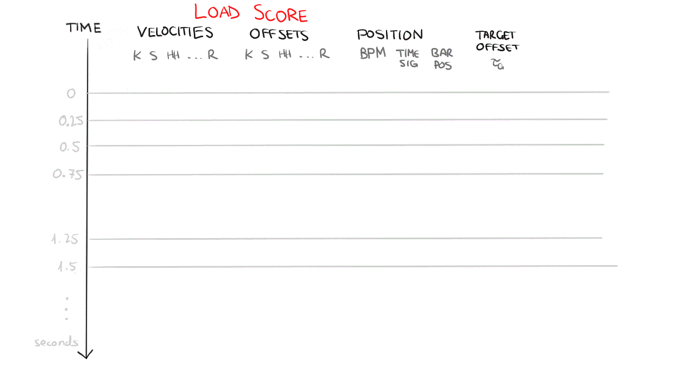

# rolypoly~

a Max object that 
- listens to your audio instrument
- interprets a MIDI drum track in anticipation and reaction to your expressive nuances
- is able to generate drum hits on the fly, autoregressively

version 2.0.1, August 2023, experimental build // [version history](VERSIONS.md)

## quickstart

first install the [FluCoMa](https://www.flucoma.org/) package - you can find it in Max's package manager

get the package from the [Releases](https://github.com/RVirmoors/rolypoly/releases) tab, and extract it into your `Documents/Max 8` folder

open the rolypoly~ overview patch from the `Extras` menu in Max

demo video coming very soon

## how does it work?

see my demo paper "Finetuning Rolypoly~ 2.0: an expressive drum machine that adapts with every performance" presented at AIMC2023

i'm also writing a blog covering hands-on specifics

and a series of [how-to videos](https://youtube.com/playlist?list=PLkr4iJAO7fYSMZM1oYECK5GKXrWN6zdq1)



## pretraining your own model

clone into `Max 8/Packages`, fetching submodules: 
- `git clone https://github.com/RVirmoors/rolypoly --recursive`

to parse the GMD dataset (or your own, similarly formatted):

- install the required Python packages: `torch, pretty_midi, numpy`
- download GMD and extract to `py/data/groove`, then use this Python script to parse .mid tracks into .csv data files

```
cd py
python midi_to_csv.py
```
this generates .csv files for all relevant .mid files in info.csv

then build the pretrain executable (windows, for now):
```
cd ../source/projects/pretrain
cmake --build . --config Release
```

if CMake doesn't do it, then manually copy the .dll files from `libtorch/lib` next to the newly-generated `pretrain.exe`. Also move the `groove` folder next to `pretrain.exe`, and run:

```
pretrain
```

## build the Max object from source (windows, for now)

you need [CMake](https://cmake.org/download/) installed

create a subfolder called `libtorch` and[download+extract LibTorch](https://pytorch.org/get-started/locally/) (Release version) into it

now go back to the project root, create a `build` subfolder and enter it:

```
mkdir build
cd build
cmake . -S ..\source\projects\rolypoly_tilde  -DCMAKE_BUILD_TYPE:STRING=Release -A x64  -DTorch_DIR="..\libtorch\share\cmake\Torch"
cmake --build . --config Release
```

## say hi

if you're interested in this tech and would like to use it / comment / contribute, I want to hear from you! Open an issue here or contact me: `grigore dot burloiu at unatc dot ro`
